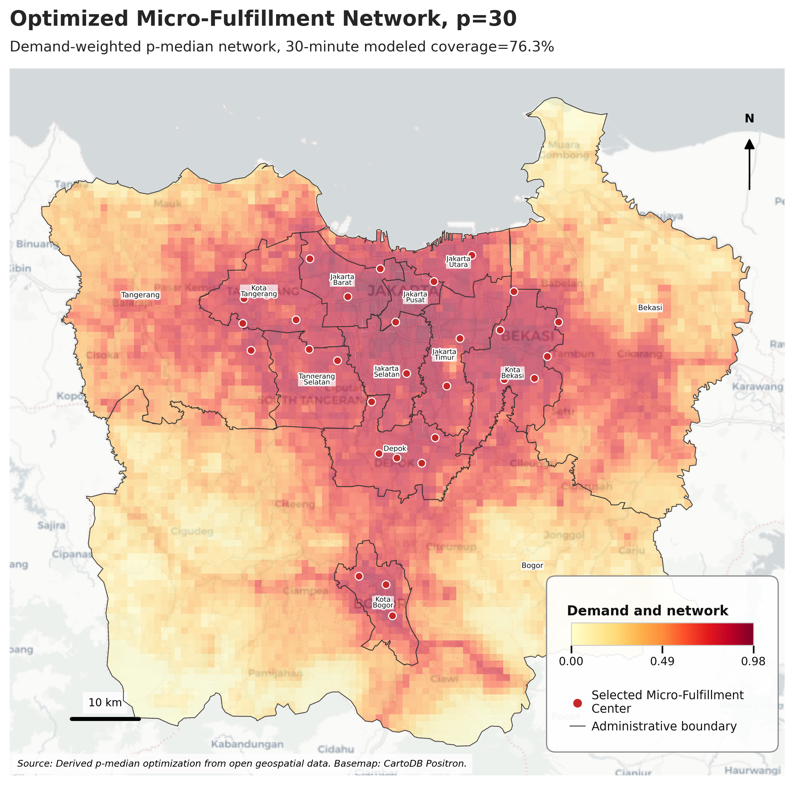
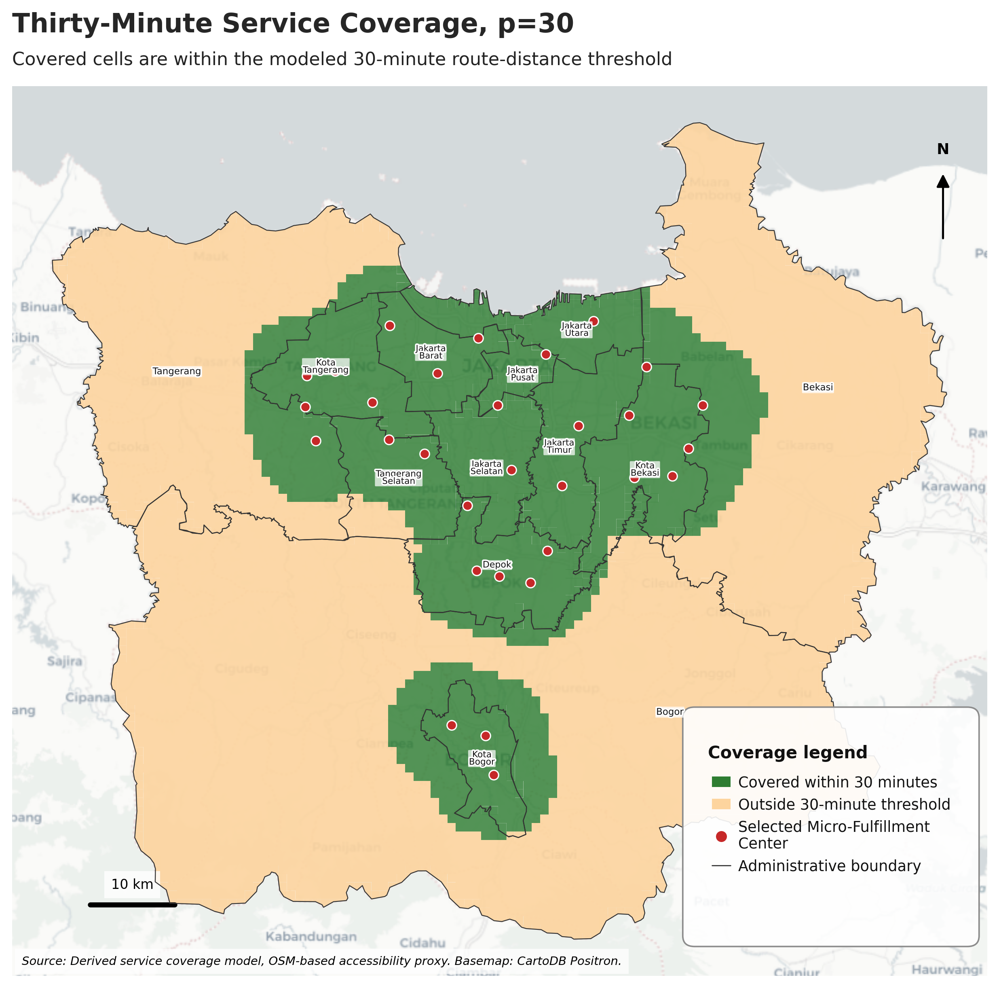
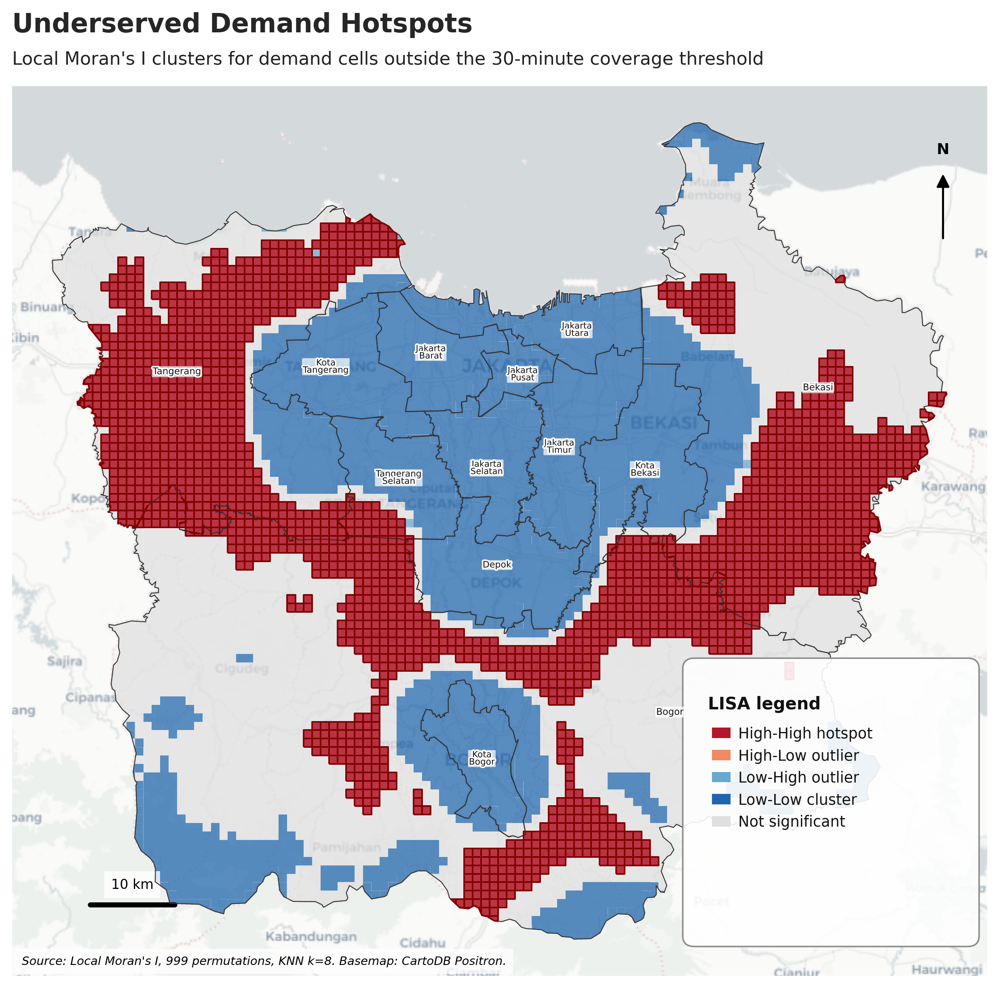
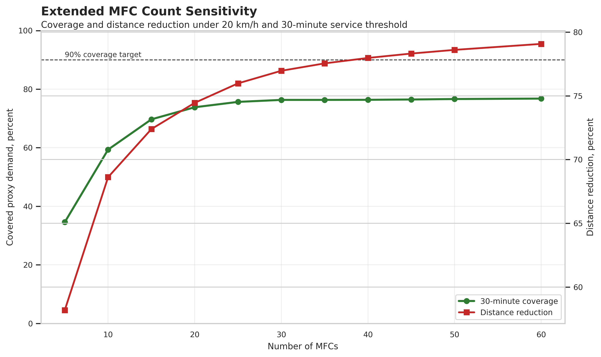
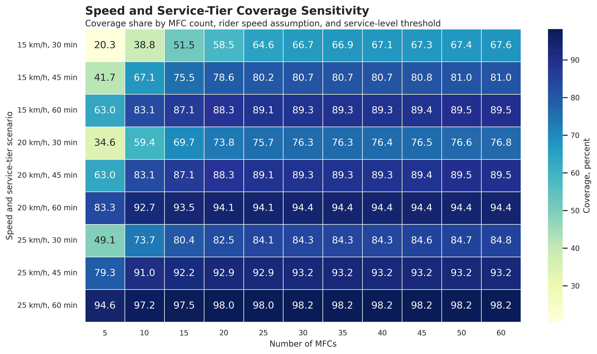
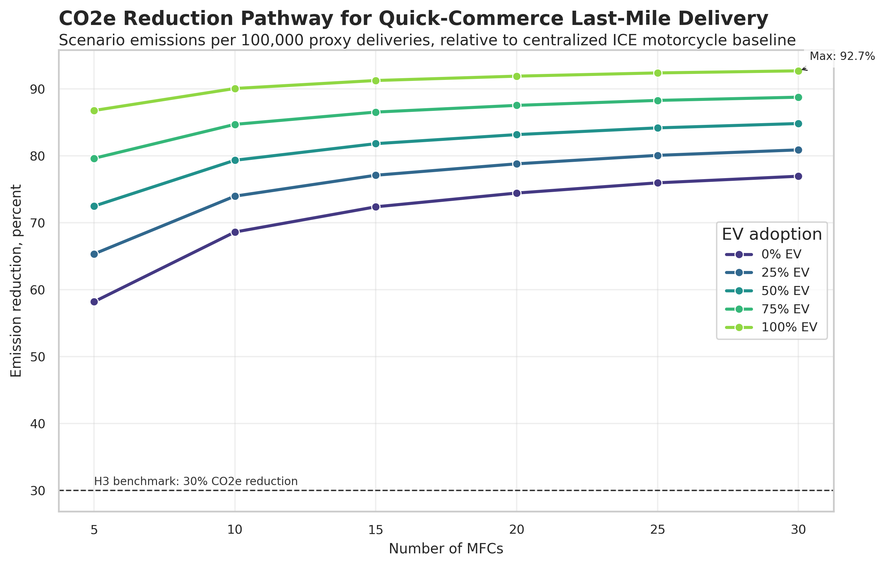
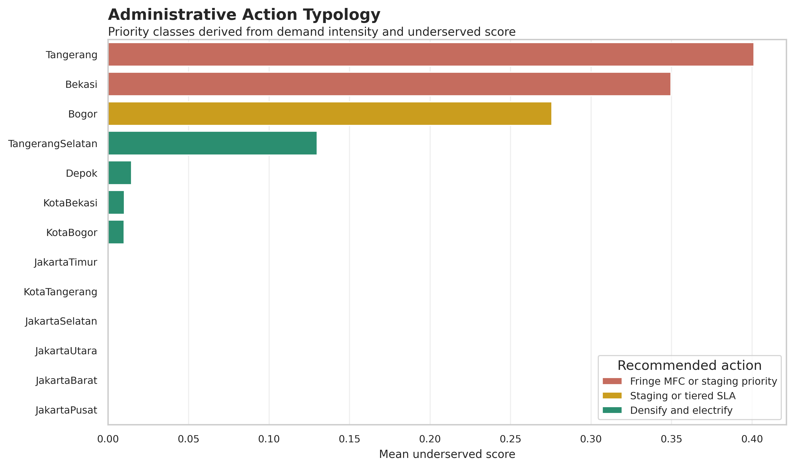

# Micro-Fulfillment Network Optimization for Quick-Commerce Decarbonization in Greater Jakarta

Open-data geospatial optimization framework for evaluating micro-fulfillment center network design, 30-minute service coverage, underserved spatial clusters, and last-mile CO2e reduction scenarios for quick-commerce operations in Greater Jakarta.

This project combines Google Earth Engine, WorldPop, VIIRS nighttime lights, Dynamic World, OpenStreetMap, p-median facility location, Moran’s I, LISA hotspot analysis, and CO2e scenario modeling in a fully reproducible Python pipeline.

## Executive Takeaway

Thirty-minute quick commerce in Greater Jakarta cannot be solved by adding micro-fulfillment centers alone.

The optimized network substantially reduces last-mile distance and emissions, but a uniform 30-minute service promise across the full metropolitan region hits a structural coverage ceiling. Dense urban cores are better suited for operational densification and fleet electrification, while fringe regencies require selective MFC expansion, rider staging points, and 45–60 minute service tiers.

## Key Results

* 30 optimized MFCs cover 76.3% of proxy demand within the modeled 30-minute threshold.
* Extending the network from 30 to 60 MFCs only increases 30-minute coverage from 76.3% to 76.8%.
* 30 MFCs reduce demand-weighted last-mile distance by 77.0% versus a centralized fulfillment baseline.
* 30 MFCs plus 50% electric motorcycle adoption reduce scenario CO2e by 84.8% per 100,000 proxy deliveries.
* A 60-minute service tier at 25 km/h reaches 98.2% coverage.
* Demand and underserved gaps are highly spatially clustered, with Moran’s I of 0.944 and 0.870.
* The largest underserved bottlenecks are located in Tangerang, Bekasi, and Bogor regencies.

## Study Area

The study area is the road-based Greater Jakarta metropolitan logistics region generated from GADM 4.1 administrative boundaries. It includes DKI Jakarta and adjacent urban jurisdictions in Tangerang, Bekasi, Bogor, and Depok. Kepulauan Seribu is excluded because the analysis focuses on road-based last-mile logistics.

## Important Interpretation Boundary

Demand in this project is a latent open-data proxy, not actual platform order volume.

The demand proxy is derived from:

* WorldPop population.
* VIIRS nighttime lights.
* Dynamic World built-up probability.
* OpenStreetMap road accessibility.
* OpenStreetMap commercial POI density.

Emissions are scenario-based per 100,000 proxy deliveries, not measured company emissions. Distance is modeled using corrected Euclidean distance, not live time-dependent routing.

## Method Overview

The pipeline follows seven main steps:

1. Generate Greater Jakarta AOI from GADM 4.1.
2. Preprocess raster data in Google Earth Engine.
3. Build a 1 km open-data quick-commerce demand proxy.
4. Generate candidate MFC locations from high-demand cells and OSM commercial POIs.
5. Optimize MFC networks using demand-weighted p-median logic.
6. Evaluate 30-minute service coverage, CO2e scenarios, and spatial clustering.
7. Run enhanced sensitivity analysis for MFC count, speed, and service-tier assumptions.

## Visual Evidence and Interpretation

### 1. Optimized Micro-Fulfillment Network

The optimized 30-MFC network reduces demand-weighted distance by 77.0% compared with a centralized baseline. However, distance reduction does not automatically translate into full 30-minute coverage. The red points indicate selected micro-fulfillment centers, while the background shows demand suitability.

Main interpretation:

* MFC placement strongly improves last-mile efficiency.
* The dense urban core is relatively serviceable.
* Remaining coverage gaps are concentrated in fringe metropolitan areas.

### 2. Thirty-Minute Service Coverage

The 30-MFC scenario covers 76.3% of proxy demand within the modeled 30-minute threshold. This means nearly one-quarter of proxy demand remains outside the 30-minute service area under the default 20 km/h and detour factor assumptions.

Main interpretation:

* A uniform 30-minute promise is difficult across the full Greater Jakarta region.
* Coverage gaps are not random.
* Fringe areas require a different operating model from dense urban cores.

### 3. Underserved Demand Hotspots

LISA hotspot analysis identifies spatially clustered underserved areas. The strongest underserved bottlenecks appear in Tangerang, Bekasi, and Bogor regencies.

Main interpretation:

* Underserved demand forms spatial clusters.
* Moran’s I for underserved score is 0.870 with p = 0.001.
* Expansion should target contiguous hotspot clusters, not isolated cells.

### 4. Extended MFC Count Sensitivity

The extended analysis tests MFC counts from 5 to 60. Increasing the network from 30 to 60 MFCs only raises 30-minute coverage from 76.3% to 76.8%.

Main interpretation:

* The system reaches a 30-minute coverage ceiling.
* Adding more MFCs alone is not enough.
* Network strategy must include staging, routing improvement, and service-tier segmentation.

### 5. Speed and Service-Tier Sensitivity

Coverage improves substantially when the service tier is relaxed from 30 to 45 or 60 minutes. The best sensitivity scenario reaches 98.2% coverage at 25 km/h and a 60-minute service tier.

Main interpretation:

* Service-tier design has more leverage than simply increasing MFC count.
* A metropolitan-wide 30-minute promise is operationally aggressive.
* A realistic strategy is 30 minutes for core urban zones and 45–60 minutes for fringe regencies.

### 6. CO2e Reduction Pathway

The 30-MFC network plus 50% EV adoption reduces scenario CO2e by 84.8% per 100,000 proxy deliveries. With 100% EV adoption, the reduction reaches 92.7%.

Main interpretation:

* Electrification is most effective after fulfillment distance is reduced.
* Decarbonization is a network design problem, not only a vehicle technology problem.
* Partial EV adoption already delivers a large reduction when paired with optimized MFC placement.

### 7. Administrative Action Typology

Administrative units are classified by demand intensity and underserved score.

Main interpretation:

* Dense urban cores are candidates for densification and electrification.
* Tangerang and Bekasi require fringe MFCs or staging strategies.
* Bogor requires careful service-tier planning because its geography is broad and less compact.

## Strategic Recommendations

### Core Urban Areas

Recommended strategy:

* Densify operations.
* Deploy electric motorcycles.
* Improve charging access.
* Optimize inventory allocation.
* Maintain 30-minute service where operationally feasible.

Relevant areas include Jakarta, Kota Tangerang, Tangerang Selatan, Depok, Kota Bekasi, and Kota Bogor.

### Fringe Regencies

Recommended strategy:

* Add selective MFCs only in underserved hotspot clusters.
* Deploy rider staging points.
* Use partner pickup nodes.
* Apply 45–60 minute service tiers.
* Avoid uniform 30-minute promises.

Priority areas include Tangerang, Bekasi, and Bogor regencies.
